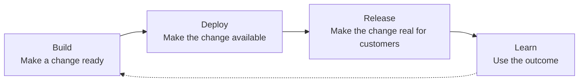

# LaunchDarkly AutoFactory

## Software factories should not stop at deployment

Software factories are getting very good at producing code. AI can help plan, implement,
test, and review a change; CI can package it; CD can move it into production. Most of the
industry's attention is concentrated on making those build and deploy stages faster.

But deployed software is not the same thing as released software.

A deployment tells us that new code is running. It does not tell us whether customers
should receive the new behavior, whether that behavior improves their experience, or
whether it should keep rolling out when production signals begin to regress. Those are
release decisions, and they are often left to manual checklists, one-off scripts, or an
implicit final step in the deployment pipeline.

That gap matters more as the rest of the factory accelerates. Producing and deploying more
changes simply creates more release decisions, more exposure risk, and more operational
load unless the factory also has a way to deliver those changes safely.

AutoFactory explores a simple point of view:

> **A software factory is incomplete until it can release what it builds, measure the
> outcome, and respond safely.**

Release is not cleanup after deployment. It is the stage where software becomes customer
experience—and where intent, risk, and production evidence must come together.

## Build, deploy, and release are different jobs



### Build: make a change ready

The build stage turns an idea into a change that is safe to place in production. That means
more than generating code and passing tests. The factory must preserve the existing
experience, understand the change's risk, define how success and failure will be measured,
and carry forward the intent needed to release it.

The output of build is not just an artifact. It is a **release-ready change**: code plus the
controls, evidence, and context required to operate it safely.

### Deploy: make the change available

The deploy stage moves that change into a production environment and proves that it can run
there. It should remain boring, repeatable, and owned by the team's existing delivery
system.

Crucially, deployment does not have to change the customer experience. When new behavior is
separated from the deployed code, teams can move software frequently without making every
deployment an all-or-nothing release event.

### Release: make the change real for customers

The release stage decides who receives the new behavior, when they receive it, and whether
the rollout should continue. This is where the factory tests its assumptions against live
production evidence.

A first-class release stage can:

- honor human intent, timing, and dependencies;
- expose a change gradually instead of all at once;
- compare the new experience with the previous one using meaningful guardrails;
- stop or roll back without rebuilding or redeploying; and
- turn the result into feedback for the next change.

This changes the goal of the software factory. The goal is not maximum code throughput or
deployment frequency in isolation. The goal is a reliable flow from idea to customer value,
with control at the point where uncertainty is highest.

## What this repository explores

LaunchDarkly AutoFactory is a working prototype of that complete loop.

At build time, a configurable graph of AI agents prepares a pull request as a release-ready
change. It places new behavior behind a feature flag, preserves the prior behavior, creates
the measurements and tests needed to evaluate the change, and records release intent beside
the code.

The team's existing CD system then deploys normally while the new behavior remains off.
Deployment makes the change available but does not expose it.

After a successful deploy, a small release orchestrator uses the intent prepared during
build to begin a guarded release in LaunchDarkly. LaunchDarkly controls exposure, evaluates
production metrics, and can return customers to the prior behavior automatically when a
guardrail regresses. The outcome is observable whether the release completes, waits, stops,
or rolls back.

The versioned release manifest in `.release-flags/` connects these stages. It lets build
prepare the release while context is fresh, lets deploy remain independent, and gives the
release stage an explicit contract to execute.

Status: this is a prototype shared with design partners, not a product. Its build and
release paths run end-to-end against a live demo repository.

## Explore the implementation

- [Reference implementation and setup](REFERENCE.md) — prerequisites, configuration,
  entry points, approval controls, observability, and deployment instructions.
- [Factory design](docs/design-partners-factory.md) — design principles and extension seams.
- [Interactive pipeline overview](docs/pipeline-overview.html) — the complete build and
  release flow, node by node.
- [Build orchestration](packages/shared/README.md) — the shared agent runtime and tools.
- [Release orchestration](packages/beacon/README.md) — the deploy notification contract,
  release discovery, triggering, and monitoring.
- [Architecture decisions](docs/adr/) — the reasoning behind the implementation.

For local development:

```bash
npm install
npm run build
npm test
npm run typecheck
```

This repository is public. `reference-private/` and `sources/repos/` are gitignored, and
`npm run check:public` checks for obvious internal material before it is committed.
