# LaunchDarkly AutoFactory

A prototype software factory spanning **build, deploy, and release**.

## Why

Software factories optimize:

- **Build**
  - plan, code, test, review
  - faster with AI
- **Deploy**
  - package, ship, verify
  - faster with CI/CD
- **Release**
  - often implicit or manual
  - where customers—and risk—actually enter the system

Deployment proves code is running. It does not prove the change is safe or valuable.
Faster build and deploy only create more release decisions unless the factory closes that
loop.

> **A software factory is incomplete until it can release what it builds, measure the
> outcome, and respond safely.**

## The complete factory

```mermaid
flowchart LR
    subgraph BUILD["BUILD — make it ready"]
        direction TB
        B1["Understand<br/>change • scope • risk"]
        B2["Prepare<br/>flag • control path"]
        B3["Prove<br/>metrics • tests • review"]
        B4[["Release manifest<br/>intent • guardrails"]]
        B1 --> B2 --> B3 --> B4
    end

    subgraph DEPLOY["DEPLOY — make it available"]
        direction TB
        D1["Build artifact"]
        D2["Existing CD deploys"]
        D3["New behavior stays off"]
        D4[["Notify<br/>service • SHA"]]
        D1 --> D2 --> D3 --> D4
    end

    subgraph RELEASE["RELEASE — make it real"]
        direction TB
        R1["Discover manifest"]
        R2["Resolve<br/>intent • policy • dependencies"]
        R3["Roll out<br/>audience • stages"]
        R4["Measure<br/>production guardrails"]
        R5{"Outcome"}
        R6["Complete"]
        R7["Hold / stop"]
        R8["Roll back"]
        R1 --> R2 --> R3 --> R4 --> R5
        R5 --> R6
        R5 --> R7
        R5 --> R8
    end

    B4 -->|"code + contract"| D1
    D4 -->|"deploy succeeded"| R1
    R6 -.->|"learn"| B1
    R7 -.->|"adjust"| B1
    R8 -.->|"repair"| B1
```

## Three different jobs

- **Build — release-ready change**
  - prior experience preserved
  - new behavior behind a flag
  - success and failure defined
  - tests, review, release intent
- **Deploy — available, not exposed**
  - existing delivery pipeline
  - code running in production
  - customer behavior unchanged
  - successful deploy notification
- **Release — controlled customer exposure**
  - human intent and dependencies honored
  - gradual rollout
  - production evidence vs. control
  - complete, hold, stop, or roll back

## What this repo demonstrates

- **Build** — configurable AI-agent graph
  - research, flagging, instrumentation, testing, review
  - GitHub, editor, Cursor, and CLI entry points
- **Deploy** — intentionally independent
  - any CD system
  - provider-neutral `{ service, sha }` handoff
- **Release** — Beacon + LaunchDarkly
  - manifest discovery
  - guarded or progressive rollout
  - metric-driven rollback
- **Contract** — `.release-flags/`
  - versioned with the code
  - prepared while context is fresh
  - executed only after deploy

Status: working design-partner prototype; not a product.

## Go deeper

- [Setup and reference](REFERENCE.md)
- [Factory design](docs/design-partners-factory.md)
- [Detailed pipeline](docs/pipeline-overview.html)
- [Build orchestration](packages/shared/README.md)
- [Release orchestration](packages/beacon/README.md)
- [Architecture decisions](docs/adr/)
