# LaunchDarkly AutoFactory

An opinionated framework for a software factory built on **LaunchDarkly Release
Primitives**.

## Why

Software factories have optimized build and deploy. AI accelerates planning, coding,
testing, and review. CI/CD makes production deployment routine. Release is still often an
implicit step, even though it is where customers and risk enter the system.

Deployment proves code is running. Release determines whether customers should receive the
change, whether it works for them, and whether it should keep rolling out.

> **A software factory is incomplete until it can release what it builds, measure the
> outcome, and respond safely.**

## The complete factory

```mermaid
flowchart LR
    subgraph BUILD["Build"]
        direction TB
        B1["Understand the change"]
        B2["Assess scope and risk"]
        B3["Add flag and control path"]
        B4["Define metrics and tests"]
        B5["Review the change"]
        B6["Write release manifest"]
        B1 --> B2 --> B3 --> B4 --> B5 --> B6
    end

    subgraph DEPLOY["Deploy"]
        direction TB
        D1["Build artifact"]
        D2["Deploy through existing CD"]
        D3["Keep new behavior off"]
        D4["Notify service and SHA"]
        D1 --> D2 --> D3 --> D4
    end

    subgraph RELEASE["Release"]
        direction TB
        R1["Discover release manifest"]
        R2["Resolve intent and dependencies"]
        R3["Select release policy"]
        R4["Roll out by audience and stage"]
        R5["Evaluate production guardrails"]
        R6{"Outcome"}
        R7["Complete"]
        R8["Hold or stop"]
        R9["Roll back"]
        R1 --> R2 --> R3 --> R4 --> R5 --> R6
        R6 --> R7
        R6 --> R8
        R6 --> R9
    end

    B6 -->|"Code and contract"| D1
    D4 -->|"Deploy succeeded"| R1
```

## The opinion

| Stage | Job | Output |
|---|---|---|
| **Build** | Make the change release-ready. Preserve the control path, define success and failure, and capture intent. | Flagged code, metrics, tests, review, release manifest |
| **Deploy** | Make the change available without exposing it. Keep the existing delivery pipeline. | Running code, behavior still off, deploy notification |
| **Release** | Control customer exposure using intent and production evidence. | Complete, hold, stop, or roll back |

The goal is not code throughput or deployment frequency in isolation. It is reliable flow
from idea to customer value, with control where uncertainty is highest.

## How the framework works

- A configurable AI-agent graph prepares each change for release.
- Any CD system deploys the code while new behavior remains off.
- Beacon translates a successful deploy into guarded or progressive LaunchDarkly releases.
- `.release-flags/` carries the versioned contract from build to release.

The reference implementation supports GitHub, editor, Cursor, and CLI entry points. Build
and release run end to end against a live demo repository.

## Go deeper

- [Setup and reference](REFERENCE.md)
- [Factory design](docs/design-partners-factory.md)
- [Detailed pipeline](docs/pipeline-overview.html)
- [Build orchestration](packages/shared/README.md)
- [Release orchestration](packages/beacon/README.md)
- [Architecture decisions](docs/adr/)
